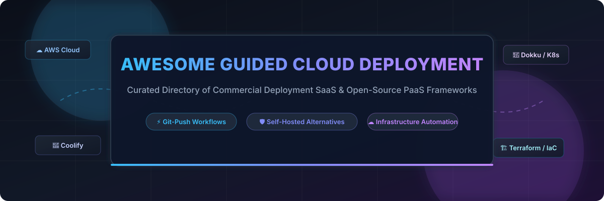

# Awesome-Guided-Cloud-Application-Deployment

# Awesome-Guided-Cloud-Application-Deployment 🚀 ☁️



  





  
  
  
  
  
  



---

## 🌟 Top Guided Cloud Application Deployment Ecosystem

**Curated List of Commercial Deployment Platforms & Open-Source PaaS Frameworks**  
*Focused on Git-Push Deploys, Infrastructure Automation, Preview Environments, Managed Databases & Self-Hosted Application Platforms*

**Last updated: October 2026** 📅

---

### 📌 Overview & SEO Summary
Welcome to the ultimate curated directory of **guided cloud application deployment platforms**, **open-source PaaS frameworks**, and **infrastructure automation tools**. Whether you are looking for enterprise-grade commercial solutions (such as *AWS Launch Wizard*, *Terraform Cloud*, and *Heroku*), or self-hostable open-source alternatives (like *Coolify*, *Dokku*, and *Dokploy*), this list covers category leaders, GitOps workflows, and privacy-respecting deployment automation.

**Key Market Context:**
- **AWS Launch Wizard** provides **guided deployment of enterprise workloads** like SQL Server, SAP, and Active Directory on AWS — **no manual architecture design required**.
- **Coolify** is the **leading open-source PaaS** with **62K+ GitHub stars**, offering **Heroku/Vercel/Netlify alternative** functionality on your own infrastructure.
- **Dokku** is the **simplest open-source PaaS**, with **32K+ GitHub stars** and **"Heroku on a VPS"** philosophy — Git-push deploys and buildpacks.

---

## 📑 Table of Contents
- [🏢 SaaS & Commercial Platforms](#-saas--commercial-platforms)
- [🔓 Open-Source GitHub Projects](#-open-source-github-projects)
- [🛠️ How to Contribute](#%EF%B8%8F-how-to-contribute)
- [📊 Star History](#-star-history)
- [🤝 Support & Sponsorship](#-support--sponsorship)
- [⚠️ Disclaimer](#%EF%B8%8F-disclaimer)

---

## 🏢 SaaS / Commercial Platforms

The guided cloud application deployment market spans **hyperscaler-native deployment services** (AWS Launch Wizard, AWS Elastic Beanstalk) that provide **guided workflows for enterprise workloads**, **infrastructure-as-code platforms** (Terraform Cloud, Pulumi) that offer **declarative infrastructure automation**, and **developer-focused PaaS platforms** (Heroku, Porter, Zeet) that simplify **application deployment with Git-push workflows**. **AWS Launch Wizard** is **free** — you pay only for the AWS resources provisioned . **Terraform Cloud** charges **$0.00014/resource/hour** on Plus tier with **500 free resources** . **Pulumi Cloud** offers **free individual tier** and **Team at $30/user/month** . **Heroku** starts at **$7/month** per dyno. **Porter** uses **cluster licensing** (BYOC model).

| SaaS / Commercial Platform | Company / Owner | Valuation / Market Cap | Standard Edition Starting Price | Free Tier / Free Trial Limits | Description |
| :--- | :--- | :--- | :--- | :--- | :--- |
| **[AWS Launch Wizard](https://aws.amazon.com/launchwizard/)** ☁️ | Amazon | ~$2.0 Trillion | **Free service**; pay only for provisioned AWS resources | **Free forever** | **AWS-native guided deployment** — **Guided deployment of enterprise workloads** like SQL Server, SAP, and Active Directory . **No manual architecture design required** . **Best practices built-in** . **Estimated deployment time and cost** before deployment . |
| **[Terraform Cloud](https://www.hashicorp.com/products/terraform)** 🏗️ | HashiCorp (IBM) | ~$5 Billion (Acquisition) | **$0.00014/resource/hour** (Plus) | **Free: 500 resources** | **Managed Terraform platform** — **Remote state management, VCS integration, and Sentinel policy as code** . **Private module registry** . **Deep infrastructure-as-code automation** . |
| **[Pulumi Cloud](https://www.pulumi.com/)** 🚀 | Pulumi | Private | **Team: $30/user/month** | **Free: Individual tier** | **Modern infrastructure as code** — **Write IaC in TypeScript, Python, Go, C#, or Java** . **Universal cloud support** . **Pulumi Cloud adds state management, secrets, and policy as code** . |
| **[AWS Elastic Beanstalk](https://aws.amazon.com/elasticbeanstalk/)** 🌱 | Amazon | ~$2.0 Trillion | **No additional charge**; pay for AWS resources | **Free tier: 750 hours for 12 months** | **AWS-native PaaS** — **Upload code and Beanstalk handles deployment, capacity provisioning, and load balancing** . **Supports Java, .NET, PHP, Node.js, Python, Ruby, Go, and Docker** . |
| **[Heroku](https://www.heroku.com/)** 🟣 | Salesforce | ~$250 Billion | **$7/month** per dyno | **Free tier retired** (November 2022) | **The original PaaS** — **Buildpacks, add-ons, and Heroku Postgres** . **Mature ecosystem** but **expensive at scale** . |
| **[Porter](https://porter.run/)** 🚪 | Porter | Private | **Cluster licensing** (BYOC) | **Free trial available** | **Kubernetes-native PaaS** — **Deploys to your own K8s cluster** (AWS, GCP, Azure) . **GitOps workflows** . |
| **[Appliku](https://appliku.com/)** 🎯 | Appliku | Private | **$49/month** (starting) | **Free trial available** | **Deployment platform for Django, Rails, and Node.js** . **Deploys to your own server** . |
| **[Coherence](https://www.withcoherence.com/)** 🔄 | Coherence | Private | **Custom pricing** | **Free trial available** | **Full-stack deployment platform** — **Ephemeral environments for every branch** . **AWS/GCP integration** . |
| **[Zeet](https://zeet.co/)** ⚡ | Zeet | Private | **$25/month** (starting) | **Free trial available** | **Deployment and DevOps platform** — **Deploys any app to any cloud** . **Preview environments** . |
| **[Flightcontrol](https://www.flightcontrol.dev/)** ✈️ | Flightcontrol | Private | **Custom pricing** | **Free trial available** | **AWS deployment platform** — **Deploys Next.js, Rails, and Docker to AWS** . **No AWS expertise required** . |

---

## 🔓 Open-Source GitHub Projects

*Sorted by GitHub_Stars_Count (Descending)* 🌟

- **[Coolify](https://github.com/coollabsio/coolify)**   
  **The leading open-source PaaS alternative to Vercel, Heroku, and Netlify**, Apache-2.0 licensed. **62,000+ GitHub stars** — **the most popular self-hosted PaaS** . **Deploy apps, databases, and 280+ one-click services** (Plausible, Gitea, Minio, n8n, and more) . **Git-push deploys** with GitHub, GitLab, Bitbucket, or Gitea — plus **preview deployments per PR** . **Nixpacks auto-detection** builds your stack without config . **Automatic SSL** via Let's Encrypt . **S3-compatible backups** . **Docker Swarm support** for multi-server . **Self-hosted version completely free** — no server limits, no feature restrictions . 🚀

- **[Dokku](https://github.com/dokku/dokku)**   
  **Docker-powered PaaS for building and managing app lifecycles**, MIT licensed. **32,147 GitHub stars** — **"Heroku on a VPS"** . **Git-push deploys with buildpacks** . **Plugin system for extensibility** . **No UI** — CLI-only . **The simplest minimal PaaS** . 🐳

- **[Dokploy](https://github.com/Dokploy/dokploy)**   
  **Open-source alternative to Vercel, Netlify, and Heroku**, source-available licensed. **37,381 GitHub stars** — **runs on Docker with Traefik** for routing and SSL . **Native GitHub, GitLab, Bitbucket, and Gitea integrations** . **Heroku Buildpacks, Nixpacks, and Paketo** support . **Self-hosted free**; managed from **$4.50/month** . 🎯

- **[Kamal](https://github.com/basecamp/kamal)**   
  **Deploy web apps anywhere**, MIT licensed. **14,585 GitHub stars** — **from Basecamp** . **Zero-downtime deploys and rolling restarts** . **Multi-server support** . **The simplest way to deploy containers to bare metal** . 🚂

- **[CapRover](https://github.com/caprover/caprover)**   
  **Scalable PaaS (automated Docker + nginx)**, Apache-2.0 licensed. **15,168 GitHub stars** — **"Heroku on Steroids"** . **One-click apps and Git-push deploys** . **Nginx reverse proxy** . **The original open-source PaaS** . ⚓

- **[OpenRun](https://github.com/openrundev/openrun)**   
  **Declarative GitOps web app deployment**, Apache-2.0 licensed. **Open-source alternative to Google Cloud Run and AWS App Runner** . **Declarative config in Starlark** . **Scale-to-zero** for idle apps . **OAuth/OIDC/SAML with RBAC** . 📝

- **[Komodo](https://github.com/moghtech/komodo)**   
  **Tool to build and deploy software on many servers**, open-source. **12,344 GitHub stars** — **multi-server deployments with build and deploy workflows** . **The most scalable open-source deployment tool** . 🦎

- **[Piku](https://github.com/piku/piku)**   
  **The tiniest PaaS you've ever seen**, MIT licensed. **6,605 GitHub stars** — **Git-push deployments to your own servers** . **~1000 lines of Python** . **The most minimal open-source PaaS** . 🐜

- **[SwiftWave](https://github.com/swiftwave-org/swiftwave)**   
  **Self-hosted lightweight PaaS for any VPS**, Apache-2.0 licensed. **890 GitHub stars** — **install on bare metal, Raspberry Pi, Hetzner, DigitalOcean** . **Docker Swarm mode** for scaling . **The most lightweight open-source PaaS** . 🌊

- **[Homerun](https://github.com/orochibraru/homerun)**   
  **Self-hosted, single-user PaaS for homelab users**, open-source. **Click-config form** for deploying Docker containers . **Point at an image or git repo, fill in env vars/port/resources, hit deploy** . **Live deploy progress streamed to UI** . **Templates for Redis, Postgres, MySQL, MongoDB, Adminer, Uptime Kuma, n8n, Vaultwarden** . 🏠

- **[Miabi](https://github.com/miabi-io/miabi)**   
  **Self-hosted PaaS with true workspace isolation and RBAC**, open-source. **Multiple clusters & locations** — one control plane drives many clusters . **Pipelines (pipeline-as-code CI/CD), build runners, and GitOps with declarative manifests** . **Marketplace** with WordPress, Ghost, Nextcloud, n8n, Gitea, and more . **Enterprise features**: SAML 2.0, SCIM, LDAP/AD . 🏢

---

## 🛠️ How to Contribute

Contributions are welcome! Follow these steps to submit new guided deployment platforms or open-source PaaS software:

1. 🍴 **Fork** the repository.
2. 📝 **Add/edit** entries in `README.md` maintaining table/list structure and formatting.
3. 🔗 Include project title, official website/GitHub link, exact Stars_Count, license, and brief description.
4. 🚀 Submit a **Pull Request** with a descriptive summary of your changes.

---

## 📊 Star History



---

## 🤝 Support & Sponsorship

If you find this guided cloud application deployment repository useful, please consider supporting the project:

- ⭐ **Star** this repository to increase visibility!
- 🔀 **Fork** and share with fellow developers, DevOps engineers, and open-source advocates.
- ☕ **Sponsor & Buy Me a Coffee**: Support ongoing open-source curation via the [GitHub Sponsor Dashboard](https://github.com/sponsors/ishandutta2007).

---

## ⚠️ Disclaimer

- This is a **community-curated** list — not exhaustive and not an endorsement. ℹ️
- **AWS Launch Wizard is free** — you pay only for the AWS resources provisioned . **Terraform Cloud charges $0.00014/resource/hour** on Plus tier with **500 free resources** . **Heroku starts at $7/month per dyno** .
- **Coolify is the most popular open-source PaaS** with **62,000+ GitHub stars** . **Dokku focuses on simplicity** with **32,147 GitHub stars** . **Dokploy adds modern features** with **37,381 GitHub stars** .
- **Open-source PaaS tools are not turnkey** — they require **server provisioning, DNS configuration, and ongoing maintenance** . **Coolify requires Docker and a server** . **Dokku requires a Linux VPS** . **Always validate deployment workflows and security with a proof-of-concept** before production deployment . 🚀

---



  <b>Made with ❤️ for developers, DevOps engineers, and open-source deployment advocates.</b>

